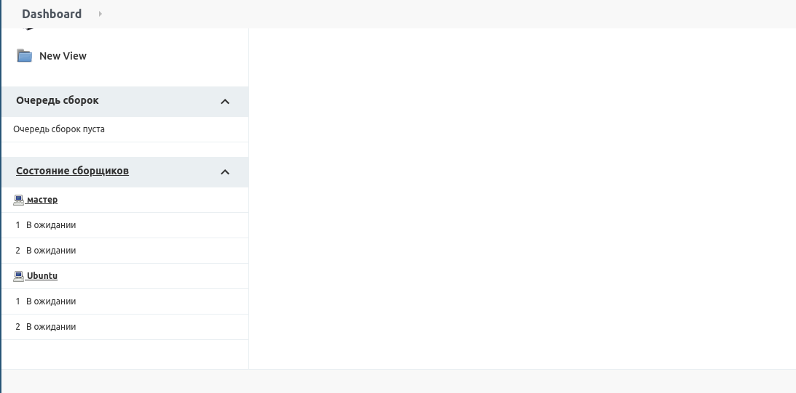
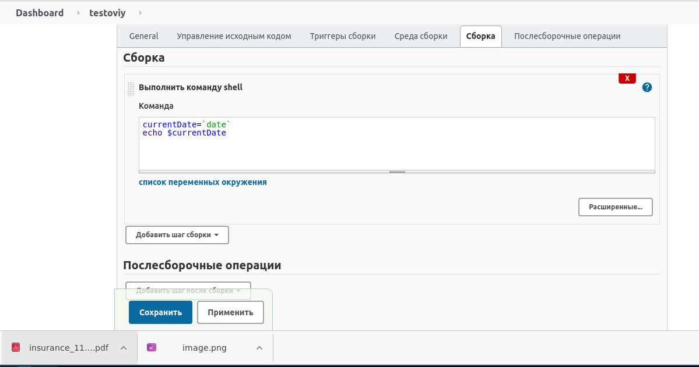
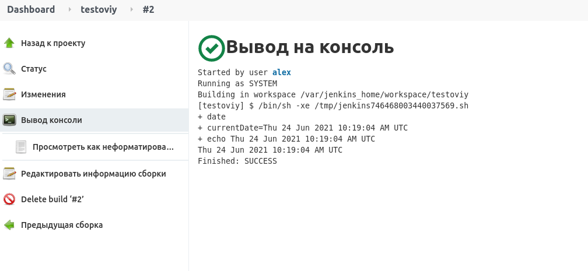
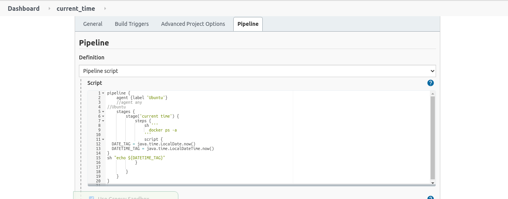
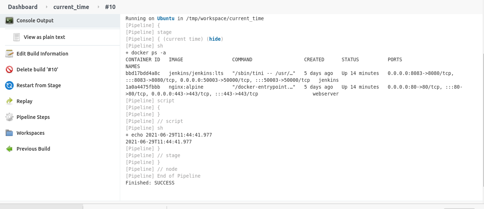
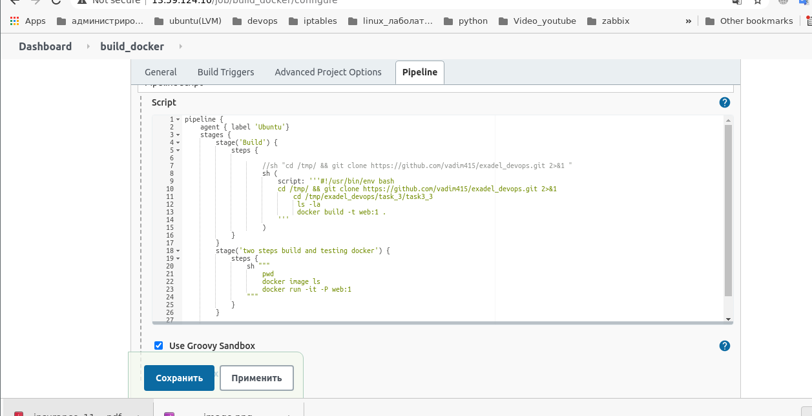

1. Установить Jenkins (Jenkins должен быть установлен  в Docker контейнере).

Установил с помощью ansible


2. Установить необходимые плагины (если потребуются на ваше усмотрение).


3. Настроить несколько билд агентов. 
Сделал вручную +1 


4.
```
Вывод

```



5. Создать Pipeline который будет на хосте выполнять команду docker ps -a.



```
Вывод

```


6.

